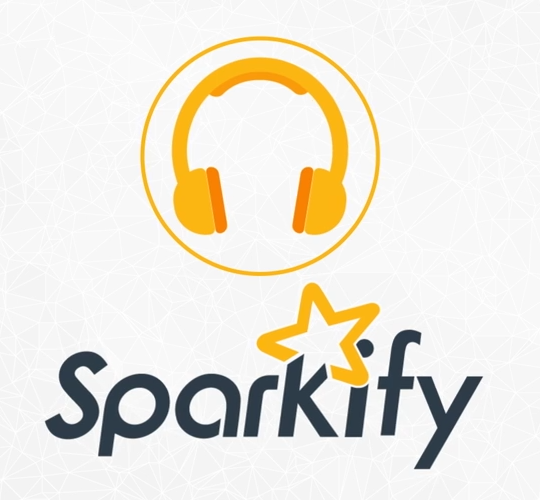

# [DSND] Project: Capstone Project - Sparkify

### Introduction
<p>
In this project I will load and manipulate a music app dataset similar to Spotify with Spark to engineer relevant features for predicting churn. Where Churn is cancelling their service altogether. By identifying these customers before they churn, the business can offer discounts and incentives to stay thereby potentially saving the business revenue. This workspace contains a tiny subset (128MB) of the full dataset available (12GB).
</p>

### Project Overview
<p>
**Sparkify** is an fictional music streaming service by Udacity to emulate a real streaming service like Spotify. The Sparkify users can stream the music with the free subscription plan with ads or the paid subscription plan without ads. Apart from using the service to listen to the music, users can swipe up or down, add songs to playlists, or even add friends. Users can change their subscription plan by **upgrading** it from free to paid, *downgrading** from paid to free, or stop using the service altogether by **canceling** the subscription.

Any user interaction with the service triggers a certain log event that represents our data. A log contains information about the event time, identifies the session and the user, includes some of user attributes, subscription plan, user interaction type etc.

We will use the mini dataset of 128MB to get used to our data and do all the necessary work. Since we are working with huge amount of data, we will use **Apache Spark** analytics engine for processing large datasets with Spark SQL query language for structured data processing.
</p>



### Problem statement
<p>
Business-wise, the word **churn** is used to refer to customers that leave the company’s service over a given time period. The businesses strive to identify the potential users who are likely to leave *before* they actually leave the service in order to take actions to retain them. Some estimate that it may costs five or six times as much to acquire a new customer than it does to retain the ones you have (https://baremetrics.com/academy/churn).

Our churned users are defined as those who **downgrade** or **cancel** the subscription. For the reasons explained later on *we will not mix* users who cancelled the subscription with users who downgraded. We’ll separately address these two churn types of users.

The identification of potential churned users is a **binary classification problem**: either a user is *churned* or *non-churned*. In order to be able to properly classify users we will perform exploratory data analysis against sample data, then we’ll engineer the features that we will find important for churn classification, and finally, we’ll exercise modelling with selected features using various learning methods.

The solution of our problem is to create a **machine learning model** that can provide prediction results achieving the *project goal* according to the chosen metrics as described in the next section.
</p>

### Project goal

<p>
**Our project is all about the prediction ability.** After all, what is it good for all the data exploratory work, all the feature engineering creativity and nice-looking code if at the end our model doesn't work?  

The project goal is to reach **0.9** of F1-score. We'll be also satisfied with a bit lower value but we'll definetely not be satisfied with the value below **0.8**.

The goal of this project is to apply data analytics and machine learning to predict whether a user is at risk of cancelling the subscription.

* The data is available in form of user events in json format
* Data needs pre-processing in form of
 * Clean up of missing or unusable data
 * Feature extraction to extract meaningful information
* On the next step, the pre-processed data is used to train several supervised machine learning model.
* The best suited model is then chosen to predict future data
</p>

### Prerequisites

Thinks you have to install or installed on your working machine:

* Python 3.7 and above
* numpy
* pandas
* pyspark
* matplotlib
* Jupyter Notebook


### Environment:
* [Miniconda](https://conda.io/miniconda.html) or [Anaconda](https://www.anaconda.com/download/)


### Installing

Use the package manager [pip](https://pip.pypa.io/en/stable/) or
[miniconda](https://conda.io/miniconda.html) or [Anaconda](https://www.anaconda.com/download/) to install your packages.  
A step by step guide to install the all necessary components in Anaconda for a Windows-64 System:
```bash
conda install -c conda-forge numpy
conda install -c conda-forge pandas
conda install -c conda-forge pyspark
conda install -c conda-forge matplotlib
```

### Project Structure
```text
Sparkify/
├── Sparkify.html
├── Sparkify.ipynb
├── mini_sparkify_event_data.zip
└── README.md
```

- Sparkify.html                 --- Generated report from notebook
- Sparkify.ipynb                --- Notebook
- mini_sparkify_event_data.zip  --- Sparkify user event log-file as zip-file (unpack it)
- README.md                     --- documentation


### Reference
<p>Dataset is provided by <a href="https://www.udacity.com/">Udacity</a>.
It is the part of <a href="https://www.udacity.com/course/data-scientist-nanodegree--nd025">Data Scientist Nanodegree</a>.</p>

### Jupyter Notebook
* `Sparkify.ipynb`

This jupyter notebook describe the whole project from udacity, from the beginning to the end.

### Running the project

The whole project is located in the jupyter notebook file `Sparkify.ipynb` and involves loading, analyzing and answering the questions contained inside. At first, please unzip the zip archiv `mini_sparkify_event_data.zip` to get the original log-file in json format.

### Authors
* Daniel Jaensch

### License
[MIT](https://choosealicense.com/licenses/mit/)
