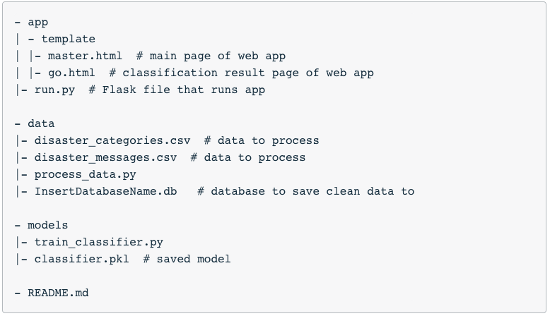

# [DSND] Project: Disaster Response Pipeline

This project analyzes the disaster data from [Figure Eight](https://www.figure-eight.com/) and builds a model for an API that classifies disaster messages.

In the project workspace, you will find a dataset of real messages sent during disaster events. These will be trained in a machine learning pipeline to categorize these events so that the messages can be sent to an appropriate disaster relief organization.

The project will include a web app where an emergency responder can enter a new message and receive classification results in various categories. The web app will also display visualizations of the data.

Below are a few screenshots of the web app.


## Project Components

There are three components you'll need to complete for this project.


### 1. ETL Pipeline

In a Python script, process_data.py, there is a data cleaning pipeline that includes:

    * Loads the messages and categories datasets
    * Merges the two datasets
    * Cleans the data
    * Stores it in a SQLite database


### 2. ML Pipeline

In a Python script, train_classifier.py, there is a machine learning pipeline that includes:

    * Loads data from the SQLite database
    * Splits the dataset into training and test sets
    * Builds a text processing and machine learning pipeline
    * Trains and tunes a model using GridSearchCV
    * Outputs results on the test set
    * Exports the final model as a pickle file


### 3. Flask Web App

We are providing much of the flask web app for you, but feel free to add extra features depending on your knowledge of flask, html, css and javascript. For this part, you'll need to:

    * Modify file paths for database and model as needed
    * Add data visualizations using Plotly in the web app. One example is provided for you


## Getting Started

The final step is to display the results in a Flask web app. The workspace with the starter files is already provided. Here, only the generated database file and the .pkl file with the model need to be uploaded / integrated.

This is the part of the project that allows for the most creativity. So if you are familiar with html, css and javascript, you can make the web application as rich as you want.

In the starter files, you will see that the web app is already working and displaying a visualization. You just need to change the file paths to your database and the picked model file as needed.

There is one more change you need to make. We have provided code for a simple data visualization. Your task will be to create two additional data visualizations in your web app based on the data you extract from the SQLite database. You can modify and copy the code we have provided in the starter files to create the visualizations.


### Prerequisites

Thinks you have to install or installed on your working machine:

* Python 3.7
* numpy
* pandas
* sqlite3
* sqlalchemy
* pickle
* nltk
* sklearn
* matplotlib
* Jupyter Notebook


### Environment:
* [Miniconda](https://conda.io/miniconda.html) or [Anaconda](https://www.anaconda.com/download/)


### Installing

Use the package manager [pip](https://pip.pypa.io/en/stable/) or
[miniconda](https://conda.io/miniconda.html) or [Anaconda](https://www.anaconda.com/download/) to install your packages.  
A step by step guide to install the all necessary components in Anaconda for a Windows-64 System:
```bash
conda install -c conda-forge numpy
conda install -c conda-forge pandas
conda install -c anaconda sqlite
conda install -c anaconda sqlalchemy
conda install -c conda-forge nltk
conda install -c anaconda scikit-learn
conda install -c conda-forge matplotlib
```

## Jupyter Notebook - Project Workspace - ETL
* `ETL Pipeline Preparation.ipynb`

The first part of your data pipeline is the Extract, Transform and Load process. This is where you read in a data set, cleanse the data, and then store it in an SQLite database. The data cleansing is performed using Pandas. To load the data into an SQLite database, the pandas dataframe .to_sql() method is used, which is used with an SQLAlchemy engine.

The final code is included in the final ETL script: 'process_data.py'


## Jupyter Notebook - Project Workspace - Machine Learning Pipeline
* `ML Pipeline Preparation.ipynb`

For the machine learning part, split the data into a training set and a test set.Then, a machine learning pipeline that uses uses NLTK, as well as scikit-learn's Pipeline and GridSearchCV to output a final model that uses the message column to predict classifications for 36 categories (multi-output classification). Finally, the final model is exported to a pickle file. After completing the notebook, the final machine learning code was inserted into 'train_classifier.py'.


## Data Pipelines: Python Scripts

Once the notebooks for the ETL and machine learning pipeline were completed, the work was transferred to Python scripts, process_data.py and train_classifier.py. When someone comes in the future with a revised or new dataset of messages, they should be able to easily create a new model by running your code. These Python scripts should be able to run with additional arguments specifying the files used for the data and the model.

Example:
```bash
python process_data.py disaster_messages.csv disaster_categories.csv DisasterResponse.db

python train_classifier.py ../data/DisasterResponse.db classifier.pkl
```

Templates for these scripts are provided in the Resources section, as well as the Project Workspace IDE. The code for handling these arguments on the command line is given to you in the templates.


## Starter Code

The coding for this project can be completed using the Project Workspace IDE provided. Here's the file structure of the project:




## Running the project

The whole project is located in the jupyter notebook files `ETL Pipeline Preparation.ipynb` and `ML Pipeline Preparation.ipynb`.


## Running the Web App from the Project Workspace IDE:
1. Run the following commands in the project's root directory to set up your database and model.

    - To run ETL pipeline that cleans data and stores in database
        `python data/process_data.py data/disaster_messages.csv data/disaster_categories.csv data/DisasterResponse.db`
    - To run ML pipeline that trains classifier and saves
        `python models/train_classifier.py data/DisasterResponse.db models/classifier.pkl`

2. Run the following command in the app's directory to run your web app.
    `python run.py`

3. Go to http://0.0.0.0:3001/


## Authors

* Daniel Jaensch

## License
[MIT](https://choosealicense.com/licenses/mit/)
